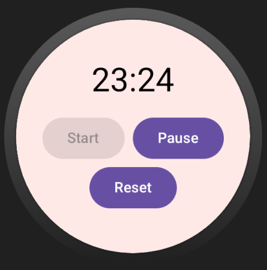
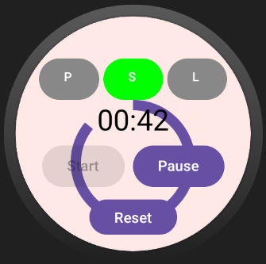
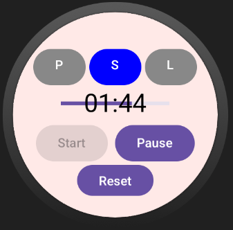

#  Focus Timer - Wear OS App

A minimalist **Pomodoro-style Focus Timer** designed specifically for Wear OS smartwatches, built with **Jetpack Compose** and **MVVM architecture**.

---

##  Features

-  Start a 25-minute Pomodoro session directly from your watch
-  View animated circular countdown timer
-  Haptic feedback on session completion
-  Built with clean MVVM architecture
-  Fully built using **Jetpack Compose**
-  Lightweight, fast, and distraction-free

---

##  What is Pomodoro-Style?

The **Pomodoro Technique** is a time management method that improves focus by breaking work into intervals.

### The Classic Cycle:
-  25 minutes of focused work (1 Pomodoro)
- ️ 5-minute short break
-  Repeat 4 times → then take a 15–30 minute long break

This WearOS app helps you:
- Stay focused during work
- Take scheduled breaks without distractions
- Use your time efficiently without needing your phone

---

## Core App Behavior

| State     | Description                             |
|-----------|-----------------------------------------|
| Idle      | Timer hasn’t started yet                |
| Running   | Countdown is in progress (25 mins)      |
| Paused    | User paused the timer                   |
| Finished  | Session complete – triggers vibration   |

---

##  Features Completed So Far

1. Built from scratch with Jetpack Compose
2. Follows MVVM architecture
3. Fully working timer logic with ViewModel
4. Circular progress bar showing real-time progress
5. Start / Pause / Reset buttons
6. SessionType support (Focus, Short Break, Long Break)
7. Haptic feedback (vibration) on session completion
8. All UI components split into reusable Composables
9. Clean folder structure: `ui`, `viewmodel`, `domain`, `util`, etc.

---

##  Tech Stack

| Layer         | Tech                             |
|---------------|----------------------------------|
| UI            | Jetpack Compose for Wear OS      |
| Architecture  | MVVM (Model-View-ViewModel)      |
| Language      | Kotlin                           |
| OS Target     | Wear OS (API 30+)                |

---

##  Folder Structure

com.towhid1zaman.focustimer\
├── presentation\
│ ├── data\
│ ├── domain\
│ │ └── model // TimerState, SessionType\
│ ├── ui\
│ │ ├── components // CircularTimer, TimerControls, etc.\
│ │ └── screens // TimerScreen.kt\
│ ├── util // VibrationHelper.kt, TimeUtils.kt\
│ └── viewmodel // TimerViewModel.kt\

---

##  Screenshots

###  Initial Timer UI

### ️ Buttons and Session Type Selector

###  Circular Progress Timer

### ➖ Optional Linear Progress View

---
📥 [Download Latest APK](https://github.com/towhid1zaman/Android/releases/tag/v1.0/FocusTimer.apk)
---

